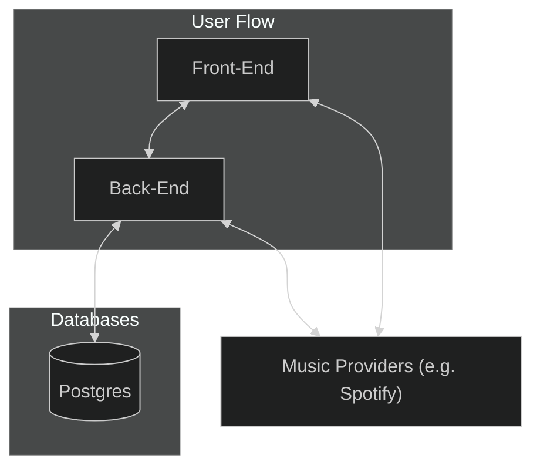

## Heat

Music is a huge passion of mine, and one idea I always wanted to explore was whether the rate at which a listener skips songs is indicative of what songs they would or would not enjoy. This idea is a bit vague, so I think a concrete example would help. Imagine a listener who consistently skips songs within the first five seconds until they land on a specific one. I wanted to explore whether it was possible to better cater to this type of listener, as well as the other side of the coin — listeners who will often sit through a full song even if they do not enjoy it within the first five seconds. The big picture of this project is to understand whether we can recommend better songs for users who like to skip, so that we can better serve their tastes.

## Demo Video

<video src="https://github.com/user-attachments/assets/2cbb800e-654c-4f0a-85c0-7b4e26963a50" controls style="max-width: 730px;"></video>

## Architecture

## Tech Stack

### Front-End

- React (familiar with it, allows me to iterate fast)
- Next.js (App Router and built-in tooling out of the box)
- SWR (client-side data fetching with caching and dedup)

### Back-End

- TypeScript + Bun (fast runtime, AMAZING overall)
- Hono (lightweight and performant web framework)
- Prisma (super familiar with it and it pairs well with Postgres)
- Pino (structured logging that plays nicely with Bun)
- Spotify Web API (OAuth + playback + track metadata)

### Database

- Postgres (familiar with it and the relational shape fits songs, artists, and skip events)

### Local Development

To get this running locally do the following.

1. Make sure you have Docker desktop installed.
2. Make sure you have mprocs installed.
3. To start both the front and back end(s), type `mprocs` in the terminal.
