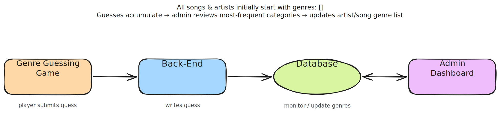
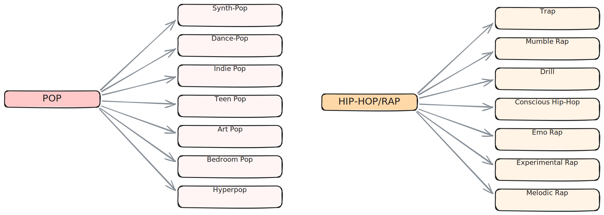
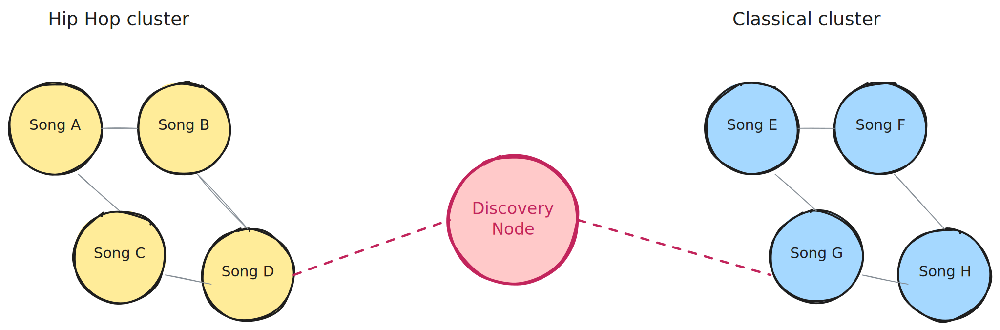
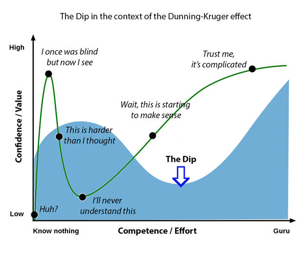

### Why Build This Project?

For me at least, the most interesting questions in recommendation systems aren't the trivial cases such as recommending songs to a user that a similar user likes, it's actually the non-trivial cases. An example of this is, how does the system adjust to abnormal user behaviour and ensure users get the best listening experience? Those moments are where recommendation systems get really interesting for me, and I wanted to build something I could tinker with to try to answer my own curiosity.

### Additional Context About The Non-Trivial Case I am Exploring

One of the common music listening patterns that I often notice is that users who have a sense of taste for music tend to skip songs very fast because they know what they like and don't like. The non-trivial case that had me very intrigued was, what if we had an user who constantly skips songs five/ten seconds in; how could we train and adjust a recommendation system to give them songs that are similar to what they're listening to but allow them to maybe stay ten, twenty or even thirty percent longer on a song. That's the non-trivial case that I wanted to explore.

### The Data Problem

During the exploration phase of the project, the first problem I discovered was that you can't train a recommendation system without users or user data (and I didn't have either).

To solve this, I decided to flip the order. Let's instead build a genre guessing game first, use the game to collect data from players, and iteratively train the model with the player guesses (I estimate this to be about 400 or so guesses before we can train a version 0 style model). While it may be deemed as unconventional, I rather have something than nothing. To ensure I do not bias the starting point, all artists and songs will be initialized with no genre categorization. However, I'll make the final call on what actually gets added in the update for artists and songs.

_An image showing the data gathering workflow._

### The Categorization Problem

The second problem was, if we have a song, how do we properly categorize it and how do we build a category hierarchy that allows a machine to recommend the right songs?

To solve this, I had to first get a foundational understanding of recommendation systems. While my understanding isn't extremely in-depth, I gained just enough knowledge to start iterating on the problem. During my research, the two main approaches I found were content-based filtering and collaborative filtering. For now, I opted to use content-based filtering because we don't have user data yet, and it allows me to tinker and build the foundation I need for a more complex system down the line. Another sub-component I had to build was a genre category hierarchy that the model can learn from and this turned out to be the hardest part. Genre category hierarchies are tricky; go too specific and the model can't generalize across similar songs, go too broad and the predictions become a burden on the user. There's also no "correct" answer, genres bleed into each other, sub-genres get contested, and the same song can belong to three different buckets depending on who you ask. Rather than deliberating endlessly, I used AI agents to find the most common genres and sub-genres globally, then manually filtered that down to a subset I'm confident I'm familiar with. The approach was simple; start small and let it grow iteratively (we only have 37 genres for now). Since I'm the one evaluating the model's outputs, sticking to genres I know well will lead to a better evaluation cycle and ultimately give us higher quality data.

_An image showing a genre and its sub-genres; this is only two of the five genres._

### How will we verify the results?

Verification is going to be very manual at this stage. I don't have a musical background and I'm not great at playing instruments, but the one thing I do think I'm good at is telling whether a song is good or not. So I'm going to be the one judging whether the songs the system recommends are actually good fits, especially in cases where an user skipped a song quickly and the system has to figure out what to play next to try to get the user to stay longer. It's not very methodical, but until there's enough data to do something more rigorous, having a human in the loop who knows the space feels like the most honest way to tell if the recommendations are good.

To make verification easier, I constrained the system to genres I'm very familiar with.

### Highlights

The coolest idea to come out of this project so far is the idea of discovery nodes. Most songs live in a cluster with other songs that sound like them, but every once in a while you find a track that sits between two totally unrelated clusters; a song that somehow bridges hip hop and classical music together. Those nodes are what make a recommendation system actually good. Anyone can recommend more of what you already like; the hard part (and the fun part) is recommending something non-trivial that you didn't know you'd love.

The genre guessing game is what surfaces these. When players consistently label two acoustically very different songs under the same genre, that's the signal! Listeners are telling us these tracks belong together even though they don't sound alike. That gap between how a song sounds and how it gets categorized is exactly where a discovery node lives.

### What's Next

The main thing right now is collecting more guesses. I'm aiming for ~400, that's the threshold I'm estimating to train an v0 model. Once I'm there, I can start tuning against both signals, what users classify songs as and how long before they skip a song and see the results.

If you want to help generate that data, [play here!](https://heat-front-end.vercel.app)

### Reflection

During the creation of this project, I learned a number of things and I wanted to share with you all.

#### Thinking on your feet

Early on, I hit many different obstacles; I didn't have enough data to train a model and I didn't understand recommednation system, but rather than sitting idle, I decided to think on my feet and really be creative about the process. So I flipped the problem and instead collected the data first, then train the model. That's what led to the genre guessing game. Shout-out J-Sang :).

#### React at depth

React is a framework I absolutely adore, but in the creation of this project I realized I know literally nothing (lol). Before this, I would always reach for an `useEffect` hook to fetch data, but during this project I noticed a few weird bugs surfacing around the dependency array. So I looked online and found that most people strongly recommend against using `useEffect` to fetch data and instead suggest something like Vercel's `useSWR` — and after using it, I agree. I love that `useSWR` caches the result even when many components access the hook, and overall it deepened my appreciation for the people focused on the web (Shout-out Vercel).

#### Orthogonal modules

While building this project, I was reading both The Pragmatic Programmer and A Philosophy of Software Design on the side. One underlying lesson that kept coming up was this idea of an "orthogonal module." In short, if two modules interact, how little code do we have to change in module A when we edit module B? To really learn the idea, I tried to apply it throughout the project. And honestly, it's a lot of fun seeing those ideas land in real code.

#### Compounding effort

Anything new is hard at the start, but if you push past that point things get easier. I have no formal machine learning background, but spending the time on it taught me that consistent effort gets you most of the way. Learning something doesn't make you excellent at it, but it gives you enough to build.

_Credit: (https://medium.com/@CatBegemot/the-dip-the-bus-and-the-dunning-kruger-effect-7e72e0f34012)_
